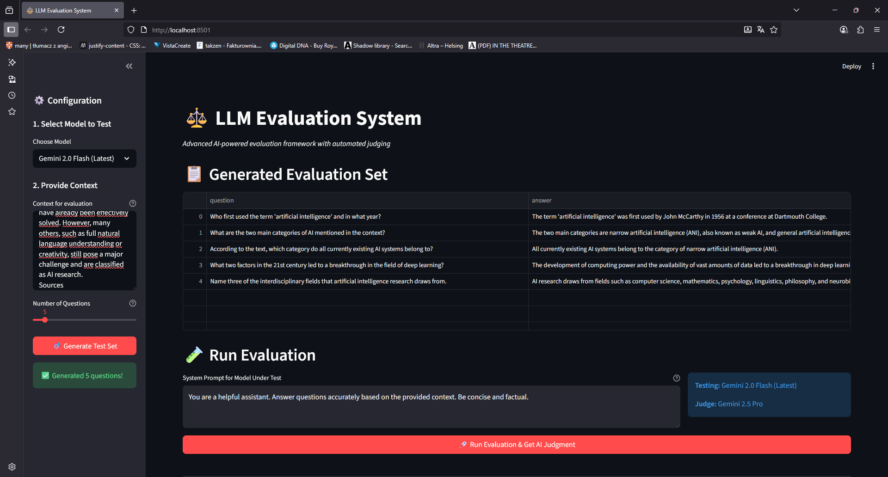

# Advanced LLM Evaluation Framework

### An interactive, enterprise-grade framework for evaluating, red-teaming, and benchmarking Large Language Models (LLMs), featuring automated test set generation, multi-metric AI-powered judging, and advanced data visualization.

    

---

## 🚀 Overview

This project moves beyond simple LLM application development into the critical domain of **AI Quality Assurance and MLOps**. It provides a robust, interactive tool for systematically evaluating and comparing the performance of Large Language Models on specific, context-aware tasks.

The framework automates the entire evaluation pipeline, from generating high-quality test data to scoring model responses using an advanced AI judge. It is designed to be a practical tool for prompt engineers, AI developers, and data scientists to make data-driven decisions about which model or system prompt is best suited for their specific use case.

### 🎯 Why This Matters

In production environments, the difference between a good and bad LLM configuration can mean:
- 📉 **30-50% reduction** in hallucinations
- 📈 **2x improvement** in user satisfaction
- 💰 **Significant cost savings** through model optimization
- ⚡ **Faster iteration cycles** with automated testing

---

## ✨ Key Features & Techniques

### 🤖 Meta-AI (AI-Powered Judging)
Implements a state-of-the-art evaluation strategy where a powerful "judge" LLM (`Gemini 2.5 Pro`) quantitatively scores the responses of other models. This demonstrates a deep understanding of modern LLM evaluation techniques used by companies like OpenAI, Anthropic, and Google.

### 📊 Multi-Metric Evaluation
The AI judge assesses responses across four critical dimensions:
- **Factual Consistency** (1-5): Alignment with ground truth
- **Helpfulness** (1-5): Practical value to the user
- **Relevance** (1-5): Direct answer to the question
- **Completeness** (1-5): Sufficient detail and coverage

### 🎲 Automated Test Set Generation
Users can provide any text-based context (documentation, articles, knowledge base), and the application uses a powerful LLM to automatically generate a relevant and diverse set of questions and ground-truth answers for testing.

### 🔄 Model & Prompt Benchmarking
The interface allows users to select from multiple available models:
- `Gemini 2.5 Pro` (Most Capable)
- `Gemini 2.0 Flash` (Fast & Efficient)
- `Gemini 1.5 Pro` (Balanced)
- `Gemini 1.5 Flash` (Cost-Effective)
- `Gemini 1.0 Pro` (Legacy)

Customize system prompts to enable direct A/B testing of different configurations.

### 📈 Advanced Data Visualization
The dashboard presents evaluation results using sophisticated **Plotly** visualizations:
- **Radar Chart**: High-level overview of model strengths/weaknesses
- **Grouped Bar Charts**: Per-question breakdown of scores
- **Summary Metrics**: Quick performance indicators

### 🛡️ Robust Engineering Practices
- **API Resilience**: Implements `safe_api_call` wrapper with rate limiting and exponential backoff retry mechanism
- **Error Handling**: Robust JSON parsing and API failure management
- **Security**: Uses environment variables for API keys, no hardcoded secrets
- **User Experience**: Clean UI with spinners, progress bars, and clear feedback
- **Caching**: Intelligent caching to reduce API calls and improve performance

### 💾 Data Export
Download detailed evaluation results as **CSV** or **JSON** for:
- Statistical analysis in Python/R
- Reporting and presentations
- Long-term performance tracking
- Integration with BI tools

---

## 🛠️ Installation & Setup

### Prerequisites
- Python 3.11 or higher
- Google AI API key ([Get one here](https://aistudio.google.com/app/apikey))
- `uv` package manager (recommended) or `pip`

### Quick Start

1. **Clone the repository:**
   ```bash
   git clone https://github.com/takzen/llm-evaluation-framework.git
   cd llm-evaluation-framework
   ```

2. **Set up your Google AI API Key:**
   ```bash
   # Create .env file
   echo "GOOGLE_API_KEY=your_api_key_here" > .env
   ```
   
   Or manually create a `.env` file with:
   ```
   GOOGLE_API_KEY="YOUR_API_KEY_HERE"
   ```

3. **Install dependencies:**
   
   **Using `uv` (recommended):**
   ```bash
   uv venv
   source .venv/bin/activate  # On Windows: .venv\Scripts\activate
   uv pip install -r requirements.txt
   ```
   
   **Using `pip`:**
   ```bash
   python -m venv .venv
   source .venv/bin/activate  # On Windows: .venv\Scripts\activate
   pip install -r requirements.txt
   ```

4. **Run the application:**
   ```bash
   streamlit run app.py
   ```
   
   The application will open automatically in your default browser at `http://localhost:8501`

---

## 📖 Usage Guide

### Step-by-Step Workflow

1. **Provide Context** (Sidebar)
   - Paste any text: documentation, articles, knowledge base content
   - This forms the basis for question generation and evaluation

2. **Configure Parameters** (Sidebar)
   - Select model to test (e.g., Gemini 2.5 Pro)
   - Choose number of questions (3-20)
   - Click "Generate Test Set"

3. **Review Test Set** (Main Area)
   - Examine generated questions and ground truth answers
   - Ensure quality and relevance

4. **Customize System Prompt** (Main Area)
   - Define how the model should behave
   - Examples: "Be concise", "Provide step-by-step explanations"

5. **Run Evaluation** (Main Area)
   - Click "Run Evaluation & Get AI Judgment"
   - Wait for progress bar (may take 1-2 minutes)

6. **Analyze Results** (Main Area)
   - Review overall metrics and visualizations
   - Examine per-question scores and reasoning
   - Export data for further analysis

### 💡 Pro Tips

- **Rate Limiting**: The app includes 7-second delays between API calls to respect rate limits
- **Cost Management**: Start with 3-5 questions for testing, then scale up
- **Prompt Engineering**: Iterate on system prompts based on AI judge feedback
- **Batch Testing**: Export results and compare multiple configurations offline

---

## 🖼️ Application Showcase

The application provides a seamless, step-by-step workflow for comprehensive LLM evaluation.

| **Step 1: Initial State** | **Step 2: Test Set Generation** |
| :---: | :---: |
|  |  |
| *Clean interface ready for configuration in the sidebar.* | *High-quality test set automatically generated from context.* |

| **Step 3: Evaluation Dashboard** | **Step 4: Detailed Results & Export** |
| :---: | :---: |
|  |  |
| *Summary metrics with interactive radar chart visualization.* | *Detailed per-question scores with AI judge reasoning and export options.* |

---

## 📦 Dependencies

```txt
streamlit>=1.30.0
google-generativeai>=0.3.0
python-dotenv>=1.0.0
pandas>=2.0.0
plotly>=5.18.0
```

---

## 🗺️ Roadmap

### Planned Features
- [ ] **A/B Testing Mode**: Compare multiple prompts side-by-side
- [ ] **Historical Tracking**: SQLite database for evaluation history
- [ ] **Custom Metrics**: User-defined evaluation criteria
- [ ] **Batch Processing**: Parallel API calls for faster evaluation
- [ ] **Cost Tracking**: Monitor API usage and expenses
- [ ] **Adversarial Testing**: Automatic generation of edge cases
- [ ] **Multi-Model Comparison**: Evaluate multiple models simultaneously
- [ ] **Report Generation**: Automated PDF reports with findings

---

## 🤝 Contributing

Contributions are welcome! Please feel free to submit a Pull Request. For major changes:

1. Fork the repository
2. Create your feature branch (`git checkout -b feature/AmazingFeature`)
3. Commit your changes (`git commit -m 'Add some AmazingFeature'`)
4. Push to the branch (`git push origin feature/AmazingFeature`)
5. Open a Pull Request

---

## 📄 License

This project is licensed under the MIT License - see the [LICENSE](LICENSE) file for details.

---

## 🙏 Acknowledgments

- **Google Gemini API** for providing powerful LLM capabilities
- **Streamlit** for the excellent web framework
- **Plotly** for interactive visualizations
- The LLM evaluation research community for pioneering these techniques

---

## 📞 Contact & Support

- **Author**: [Your Name]
- **GitHub**: [@takzen](https://github.com/takzen)
- **Issues**: [Report bugs or request features](https://github.com/takzen/llm-evaluation-framework/issues)

---

<div align="center">

**⭐ If you find this project helpful, please consider giving it a star! ⭐**

Made with ❤️ for the AI/ML community

</div>